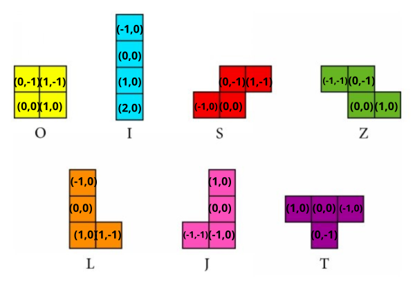

## Index

*Logo

*Index

*Project Description

*Project Status

*App characteristics and demo

## Project Description

The classic Tetris game from 1987, made with Javascript's library <a href="https://p5js.org/" target="_blank">p5.js</a> and <a href="https://vitejs.dev/" target="_blank">Vite</a>. 

## Project Status

<h4 align="center">
:construction: Finished project :construction:
</h4>

## :hammer:App characteristics and demo

The game board and tetriminos were made using vectors. Each tetrimino rotates over its axis (0,0). The original music of the game has been added to take the user to those old arcade days.

<h4 align="center">I hope you enjoy it as much as I enjoyed programming it!</h4>
